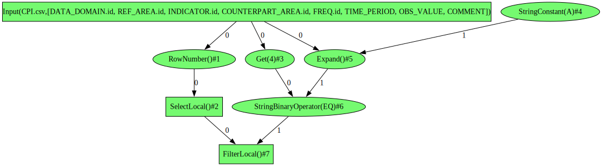
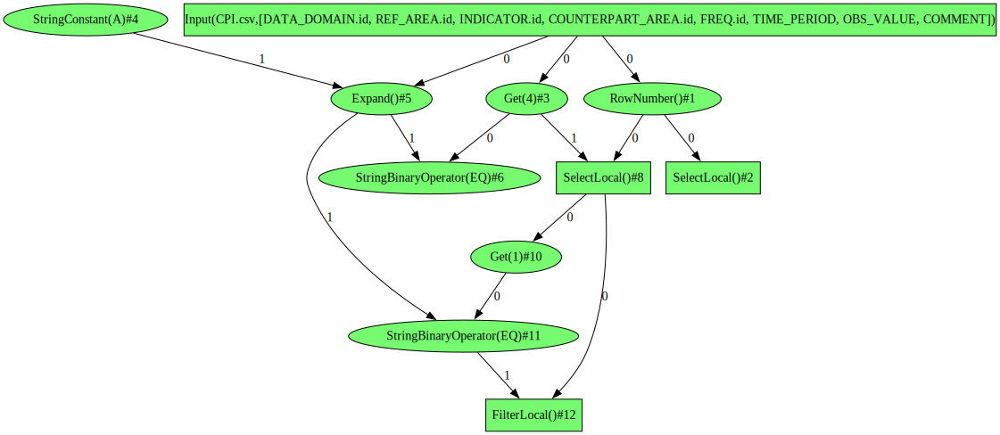

# EnrichSource rule design

## What is the issue this rule is solving?

### Narrow schema after translation

In our design every plan has minimum possible schema to be able to get data. Usually it's only a set of row number
columns without any data. It means that if we define a filter it will look as follows in the graph:
<p style="text-align: center;">
  
</p>
Input 1 of the filter is a condition, and it's disconnected from the source node, which is the input 0.
It's essential for Spark engine that condition is getting columns from the source, so that we can
turn condition into a Spark expression. If that's not the case, then Spark won't be able to resolve the columns.

### Expressions instead of column indices

Another problem is that many `Plan` nodes have expressions instead of indices and the issue described above
is relevant for many implementations: `LookupLocal`, `NestedAggregateLocal`, `FilterLocal`, `DistinctByLocal`, etc.
As a result the rule should solve the issue in a generic way, which means that adding a new Plan should not
lead to the code change in the rule. Enumerating all possible cases is not feasible and maintainable.

## How to solve

### Change Plan's API

To solve this issue we should provide additional API to `Plan` nodes. This API should output in some way
pairs of `(Plan, List<Expressions>)`, where each expression corresponding to a plan should get
all the columns from this plan.

To accomplish it we may introduce a simple convention, which works, but it's quite fragile and might produce errors.

Each input plan has a corresponding list of expressions, which might be empty.
So there is always 1-to-1 correspondence between plan and list of expressions.

```java
class NestedAggregateLocal extends Plan2 {

    public NestedAggregateLocal(Plan layout, Plan source,
                                Expression key, List<Expression> values,
                                AggregateFunction function) {
        super(layout, source, List.of(), Util.listOf(key, values));
        this.function = function;
    }
}
```

A more reliable approach would be to add an API that makes this requirement explicit by changing the constructor
of the `Plan` node, but keeping the `Node` structure untouched.

```java
class NestedAggregateLocal extends Plan2 {

    public NestedAggregateLocal(Plan layout, Plan source,
                                Expression key, List<Expression> values,
                                AggregateFunction function) {
        super(
                sourceOf(layout),
                sourceOf(source, Util.listOf(key, values))
        );
        this.function = function;
    }
}

class Plan2 extends Plan {

    protected Plan2(Source source1, Source source2) {
        super(source1, source2);
    }
}

class Plan {

    protected Plan(Source... sources) {}

    protected static Source sourceOf(Plan plan, List<Expression> expressions) {
       return new Source(plan, expressions);
    }

    public record Source(Plan plan, List<Expression> expressions) {}
}
```

### Rule implementation

Having `Plan` constructor changed it becomes simpler to implement a reliable generic rule.

Algorithm:

1. Apply only for a `Plan` node that has expressions or plans defined.
2. For a given node check for every source in the list `List<(Plan, List<Expression>)>` whether it
   has `Get` expression that is not from the `Plan`.
3. If at least one `Get` is not from `Plan` rule proceeds to cloning the given node, otherwise return.
4. Process every `(Plan, List<Expression>)` separately, if it's correct just add to the input, otherwise clone.
5. Cloning procedure creates a new `SelectLocal` as a new-source `Plan`.
6. Clones every `List<Expression>` expression and connects to the new-source `Plan`.
7. Add cloned source `(Plan, List<Expression>)` to the list of inputs.
8. Clone the given node with the new sources.

On the picture below the rule created new source `SelectLocal()#8` (`SelectLocal()#2` is the original).
Additionally, cloned and reconnected `StringBinaryOperator(EQ)#11` (`StringBinaryOperator(EQ)#6` is the original)
to a `SelectLocal()#8`. If a node had more pairs like this, all of them would be handled.
<p style="text-align: center;">
  
</p>