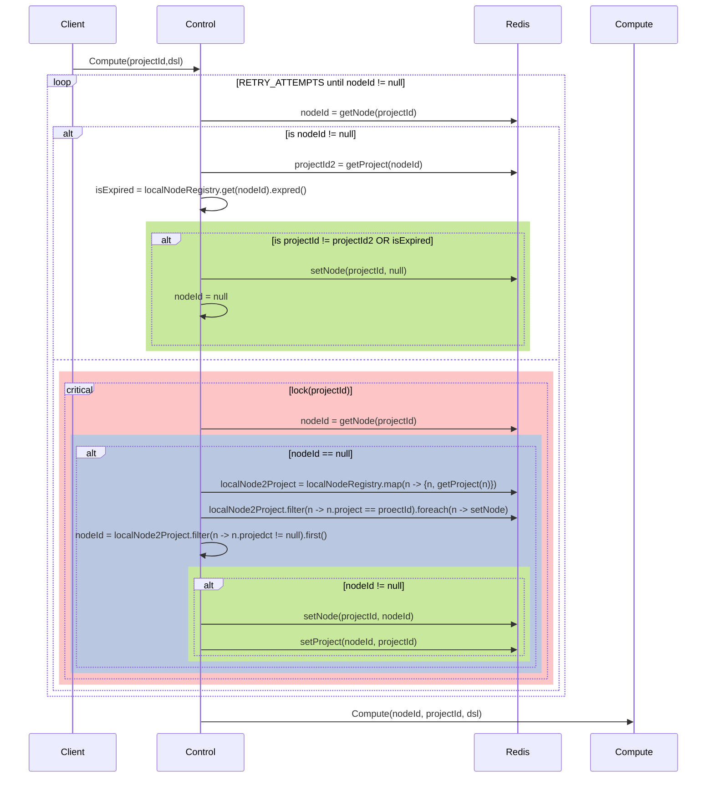

# Basic cluster

## Goal

What I want to achieve as in MVP - I want to give home for up to 100 simultaneous users/projects. And setup very clear expectations of what is working and what is not:  
1. Your project starts failing - it's because you are consuming more than Xgb (let's say 4gb)
2. We cannot run you - that's because too many simultaneous requests. Please come back later. 

## Usecases

1. Peak load: many users come to use the platform nearly simultaneously and open up to 100 projects.
2. User start using project and quickly created project that takes more than limit (4gb). User got clear message that his project is beyound allowed data size.
3. After peak load, load reduced to average. We should make sure we are not paying for unused resources.

## Main diagram

### Not MVP

1. K8S autoscaling
(use fix size t-instances cluster)
2. Resource based affinity
(use number of projects)
3. We don't have to immediately replace transport to 
SSE/HTTP2, (we can keep WS for now)

## Main sync pattern

1. [RemoteComputeService](https://gitlab.deltixhub.com/Deltix/quantgrid/-/blob/main/backend/web/src/main/java/com/epam/deltix/quantgrid/web/service/compute/RemoteComputeService.java)
2. [LocalComputeService](https://gitlab.deltixhub.com/Deltix/quantgrid/-/blob/main/backend/web/src/main/java/com/epam/deltix/quantgrid/web/service/compute/LocalComputeService.java)

### Notes

- Per projectId lock prevents setting project2node concurrently. Except setting it to null in the first case.
- We may incorrectly assign node that left the cluster. But next time we will select again.
- Few request will fail if k8s will move the pod (under assumption k8s will stop app gracefully). Also we would need to recalc the state. 
- Failed node (or node that incorrectly left the cluster) might keep single assigned project inaccessible for nodeHeartbeatTimeout (60s). 
- Failed request (404 included) is not the reason to reassigning new node after a fail. 
- Zombie node (that do not work but keep sending heartbeat) might be significant problem. 
- We may return 503 if we have unassigned compute nodes (recently joined). 
- Pod that once grew will never narrow itself down. Let's see if we have such situations on practice. (practically it means that we do not really minimizeing resource consumption)

